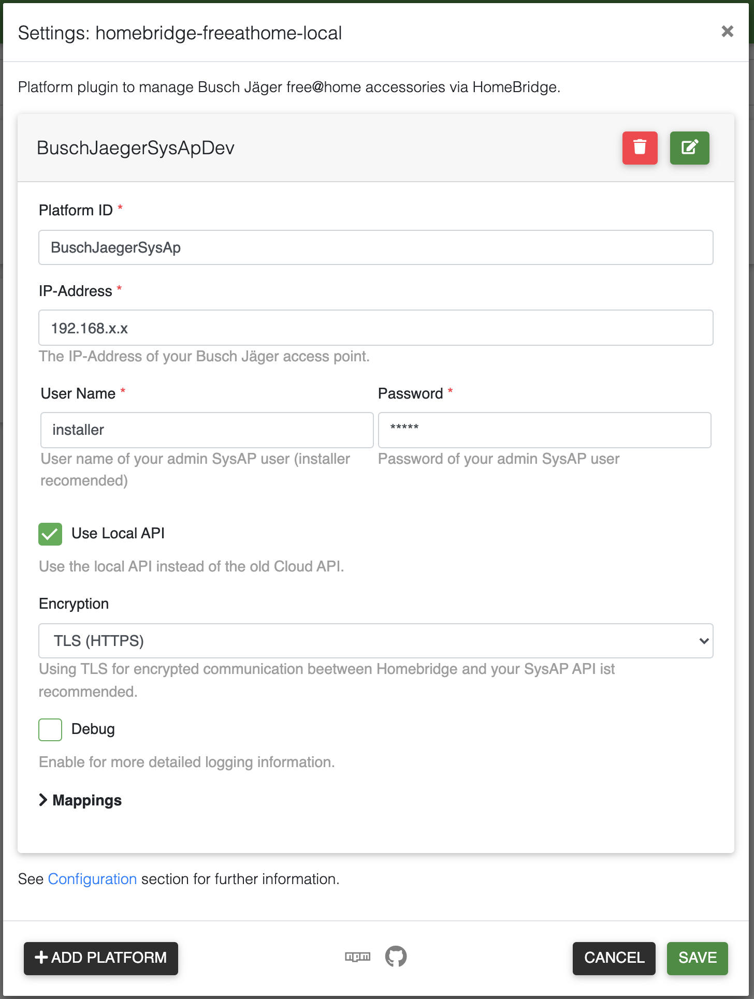

[Install Homebridge]: https://github.com/nfarina/homebridge#installation
[Install free@home API]: https://github.com/henry-spanka/freeathome-api
[Configuration]: #Configuration

[sstadlberger]: https://github.com/sstadlberger
[Home Hub]: https://support.apple.com/en-us/HT207057

# homebridge-freeathome

Homebridge platform plugin for free@home SmartHome devices.


[](https://www.npmjs.com/package/homebridge-freeathome-local)
[](https://www.npmjs.com/package/homebridge-freeathome-local)
[](https://github.com/superyaro/homebridge-freeathome/issues)
[](https://github.com/superyaro/homebridge-freeathome/pulls)


**IMPORTANT:** If you upgrade from `< 2.0.0` please read the [Upgrade Notes](CHANGELOG.md) carefully before installing this plugin.

# Features
* Control your Busch-Jaeger Lights, Outlets, Blinds and more with Apple devices with Homekit
* Setup automations with the HomeKit UI
* Ask Siri to control your devices
* Experimental Feature: Use Local REST API

# Supported accessories
- Binary Sensors
- Outlets
- Lights
- Dimmable Lights
- Thermostats
- Door Locks
- Media Players (Sonos)
- Smoke Sensors
- Blinds / Shutters
- Window Contact Sensors
- Motion Sensors

# Custom Actuators
- A switch actuator can be exposed as a (video) DoorBell.
- A switch actuator can be exposed as a Garage Door.

# Requirements
* free@home Access Point
* A linux-based server on your home network that runs 24/7 like a Raspberry Pi.

# Setup / Installation
1. [Install Homebridge]
2. `npm install homebridge-freeathome`
3. Edit `config.json` and configure platform. See [Configuration](#configuration) section.
4. Start Homebridge
5. Star the repository ;)

# Configuration
You can configure the plugin in [Homebridge Config UI X](https://github.com/oznu/homebridge-config-ui-x#readme) now:

Caveats: the mapping for blacklisted actuators doesn't work yet, since  *Homebridge Config UI X* demands a different json structure.

Of course you can configure the Plugin still raw in the `config.json`:

```json
{
    "platform": "free@home",
    "sysIP": "<IP>",
    "username": "<USERNAME>",
    "password": "<PASSWORD>",
    "isLocalAPI": <true|false>,
    "dimmActorMinValue": <0|100>,
    "mappings": {}
}
```

Replace `<IP>` with the IP of your System Access Point.

You can configure the *mappings* if you want to ignore an actuator or channel if they are not connected/unused to hide them from the HomeKit UI. However this is only needed in rare cases. Usually you can leave this blank.

```json
{
    "platform": "free@home",
    "sysIP": "<IP>",
    "username": "<USERNAME>",
    "password": "<PASSWORD>",
    "isLocalAPI": <true|false>,
    "dimmActorMinValue": <0|100>,
    "mappings": {
        "<ACTUATOR-SERIAL>": {
            "blacklist": ["ch0000", "ch0001"],
        },
        "<ACTUATOR-SERIAL>": {
            "blacklist": ["*"],
        }
    }
}
```

You can find the actuator serial in the web interface of the free@home SysAp Interface.

## Local REST API

You need to activate local API settings in the SysAP settings of the free@home next App: https://developer.eu.mybuildings.abb.com/fah_local/prerequisites/ 

This feature is NOT available in the web backend!

You should activate SSH (TLS) support as well in Settings > Service in the App or backend.

User/Password will be the same as for the Cloud API, the user "installer" seems to be the most reliable.

In your config.json you need to set `"isLocalAPI": true,`

That's it, good luck keeping your data at home!

## (Video) DoorBell
See the [DoorBell Tutorial](docs/DoorBellTutorial.md) on how to setup the free@home DoorBell in HomeKit.

## Garage Door
See the [GarageDoor Tutorial](docs/GarageDoorTutorial.md) on how to expose a Switch actuator as a GarageDoor accessory.

# Limitations
* ~~The door can not be controlled with HomeKit as the bus is not connected to the SysAp.~~
*Already implemented via free@HomeTouch 7 Panel*
* The door camera can not be accessed. You may want to use IP cameras that support the rtsp protocol and use
the video door bell.

# Notes
* The accessories can only be controlled when you're at home in your local WiFi network.
To manage your accessories remotely you need to setup an iPad/Homepod or Apple TV as a [Home Hub].

# Tips & Tricks
* Do not restart Homebridge if you are either updating the SysAp or an actuator as the accessory may be removed from
HomeKit if it is not detected during discovery.
* If the HomeKit UI does not respond to manual changes (switch pressed) or the accessory doesn't update itself log into the System Access Point interface and log out again. The SysAp might disable websocket notifications if the connection is idle for too long.

# Changelog
The changelog can be viewed [here](CHANGELOG.md).

# Upgrade Notes
Upgrade Notes can be found in the [CHANGELOG](CHANGELOG.md).

# Help
If you have any questions or help please open an issue on the GitHub project page.

# Contributing
Pull requests are always welcome. If you have a device that is not supported yet please open an issue or open a pull request with
your modifications.

# Donation
If you find my work useful you can support the ongoing development of this project by buying me a [cup of coffee](https://www.paypal.me/Hspanka)

# License
The project is subject to the MIT license unless otherwise noted. A copy can be found in the root directory of the project [LICENSE](LICENSE).
